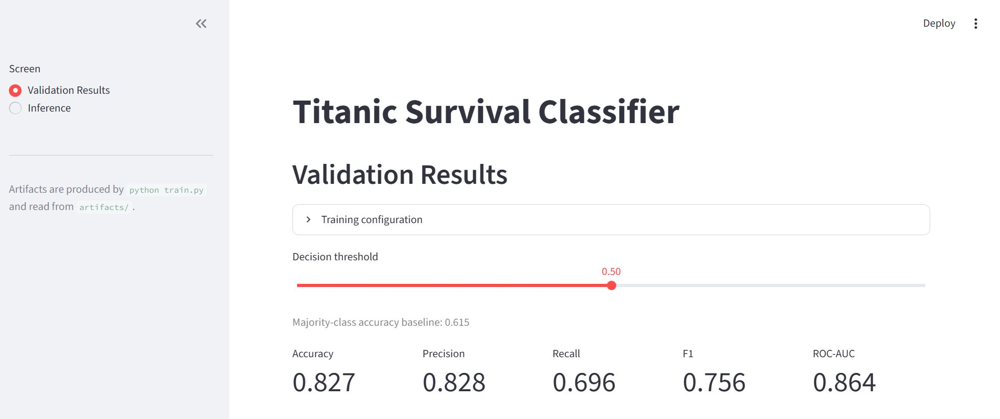
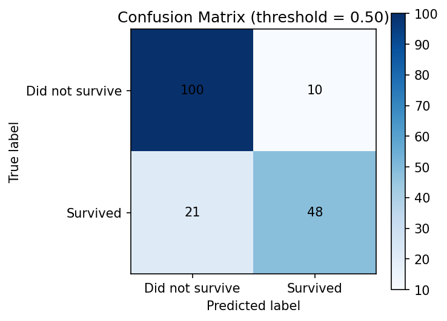
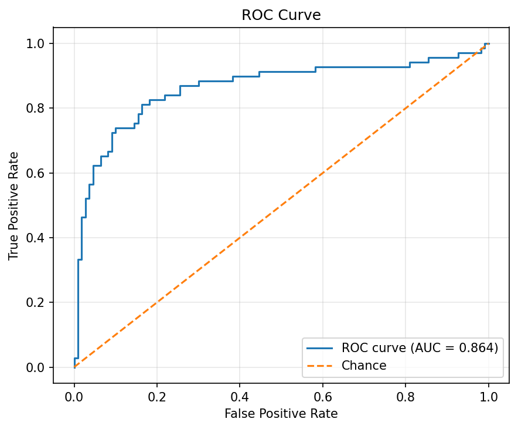
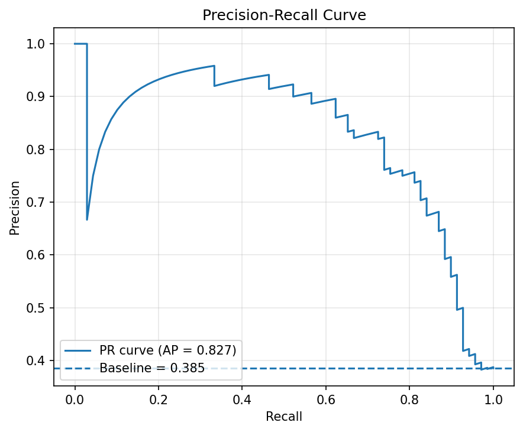
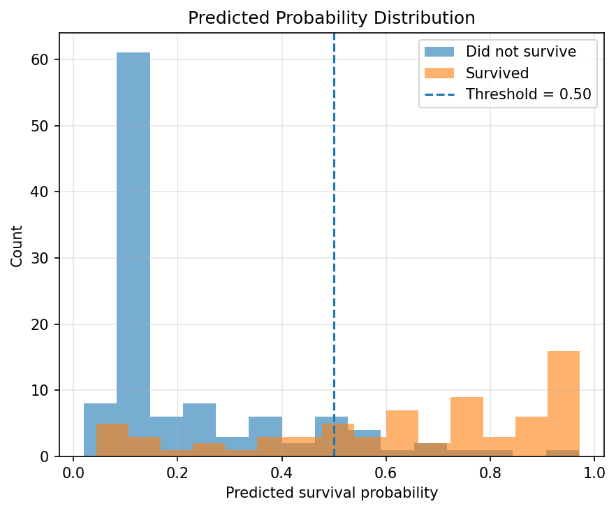
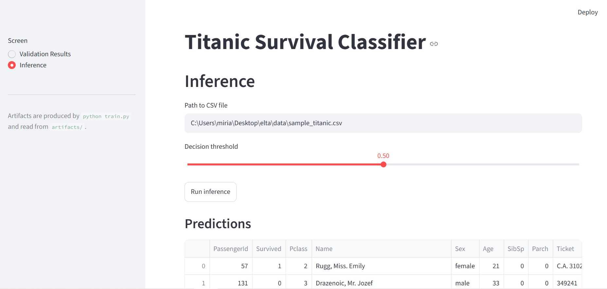
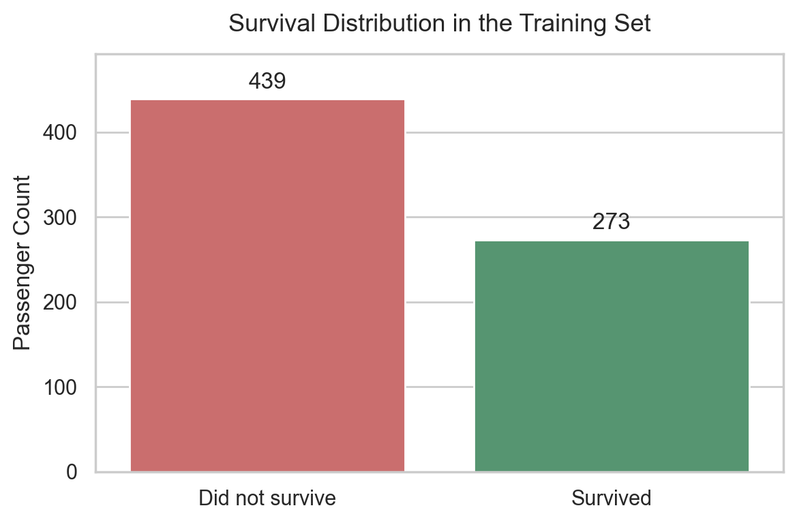
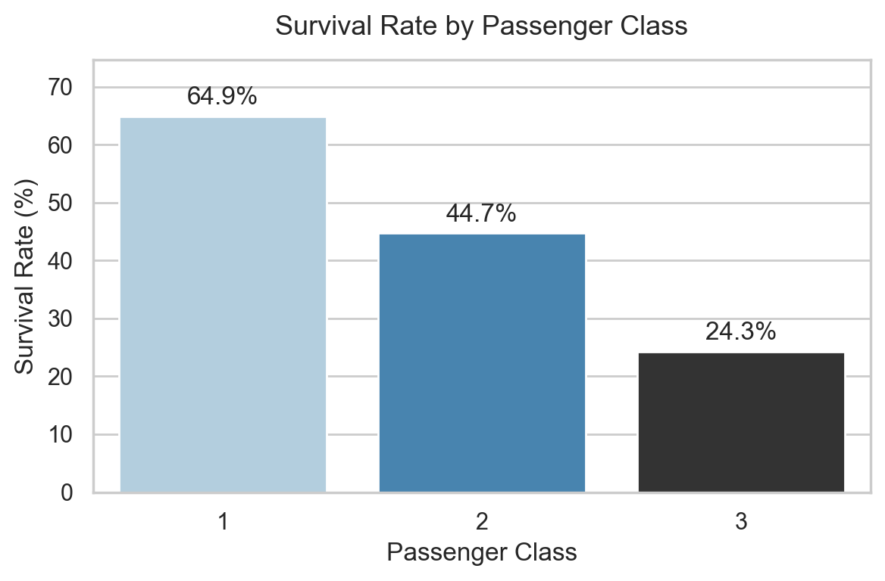
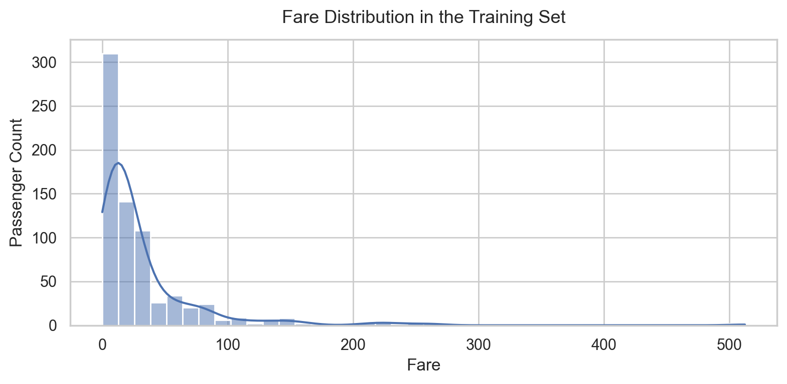

# Titanic Survival Classification

An end-to-end classification pipeline predicting passenger survival on the
Titanic: data acquisition from Kaggle, exploratory analysis, preprocessing, a
PyTorch classifier trained by a standalone script, and a Streamlit app for
viewing validation results and running inference on new data.

Only `train.csv` from the Kaggle competition is used. The held-out validation
set is carved out of it by a seeded stratified split; `test.csv` and
`gender_submission.csv` are never read.

---

## Results

Measured on the 179-row held-out validation split (seed 42, 80/20 stratified):

| Metric | Value |
|---|---|
| Accuracy | **0.827** |
| Precision | 0.828 |
| Recall | 0.696 |
| F1 | 0.756 |
| ROC-AUC | 0.864 |

A majority-class classifier that predicts "did not survive" for everyone scores
**0.615** accuracy on this split, so that is the bar the model has to clear.

<!-- TODO (Miriam): one or two sentences interpreting these numbers. Worth
     covering: precision (0.828) is well above recall (0.696), meaning the
     model is conservative about predicting survival at a 0.5 threshold - it
     misses survivors more often than it invents them. The app's threshold
     slider exposes that trade-off directly. -->

---

## Setup

### Requirements

- Python 3.11 (developed on 3.11.4)
- A Kaggle account, for the dataset download

### Installation

```bash
git clone <your-repo-url>
cd elta
pip install -r requirements.txt
```

### Kaggle credentials

The dataset is fetched in code via `kagglehub`, which needs an API token.

1. Go to [kaggle.com/settings](https://www.kaggle.com/settings) → **API Tokens**
   → **Generate New Token**.
2. Save the token to `~/.kaggle/access_token` (or on Windows,
   `C:\Users\<you>\.kaggle\access_token`).
3. **Accept the competition rules** at
   [kaggle.com/competitions/titanic](https://www.kaggle.com/competitions/titanic)
   by clicking **Join Competition**. The API returns `403 Forbidden` until this
   is done, regardless of whether the token is valid.

The legacy `kaggle.json` credential format is also supported.

`data/sample_titanic.csv` is committed to the repo, so the inference screen can
be exercised without Kaggle access.

---

## Running

### Train

```bash
python train.py
```

Downloads the data if it is not already local, fits the preprocessing pipeline
on the training split, trains the network with early stopping, and writes four
files to `artifacts/`:

| File | Contents |
|---|---|
| `model.pt` | Network weights (`state_dict`) |
| `preprocessor.joblib` | Fitted `ColumnTransformer` |
| `metadata.json` | Architecture, hyperparameters, feature names, metrics |
| `val_predictions.csv` | Per-row `y_true` / `y_prob` on the validation split |

Hyperparameters can be overridden:

```bash
python train.py --epochs 300 --lr 5e-4 --seed 7
```

### Run the app

```bash
streamlit run ds_app.py
```

Requires `python train.py` to have been run first.

### Exploratory analysis

```bash
jupyter lab notebooks/eda.ipynb
```

---

## Example usage

### Validation Results screen



Metrics and plots for the held-out split, with a decision-threshold slider that
recomputes them live.

| | |
|---|---|
|  |  |
|  |  |

### Inference screen



Enter a path to a CSV, load the trained model from disk, and get predictions.
Try it with the bundled sample:

```
data/sample_titanic.csv
```

If the file contains a `Survived` column, the full evaluation is shown for it.
If it does not, predictions are returned on their own — that is the normal
inference case, not an error.

---

## Architecture

```
src/data.py          Kaggle download, loading, stratified train/val split
src/preprocess.py    Feature engineering + the fitted ColumnTransformer
src/model.py         TitanicNet (PyTorch) + weight persistence
src/evaluate.py      Metrics and plot helpers
train.py             Standalone training script -> artifacts/
ds_app.py            Streamlit app (validation + inference screens)
notebooks/eda.ipynb  Exploratory analysis
```

The `src/` modules hold logic shared by three consumers — the notebook,
`train.py`, and the app — so nothing is implemented twice. `model.py` is
separate from `train.py` specifically because the app needs the network class
to reload weights, but must not depend on training code.

### Model

A small MLP: `17 → 64 → 32 → 1`, ReLU activations, dropout 0.3, 3,265
parameters. It outputs a raw logit; the sigmoid is applied by
`BCEWithLogitsLoss` during training and by `predict_proba` at inference, which
is numerically more stable than a `Sigmoid` + `BCELoss` pair.

Adam at lr 1e-3, batch size 32, up to 200 epochs with early stopping on
validation loss (patience 20). Training stopped at epoch 30 with the best
weights from epoch 10 — with 712 training rows, overfitting sets in quickly,
which is also what motivates the dropout.

### Preprocessing

Split into two deliberately separate stages:

**1. Row-local feature engineering** (`add_engineered_features`) — every feature
is derived from the passenger's own row, so it produces identical output on the
full training set and on a single-row CSV:

| Feature | Derivation |
|---|---|
| `AgeMissing` | `Age.isna()` — computed *before* imputation, or the signal is lost |
| `FamilySize` | `SibSp + Parch + 1` |
| `IsAlone` | `FamilySize == 1` |
| `CabinRecorded` | `Cabin.notna()` |
| `TitleGrouped` | Title from `Name`; rare titles collapsed to `Rare` |

**2. A learned `ColumnTransformer`**, fitted on the training split only and
merely applied to validation and inference data:

| Group | Features | Steps |
|---|---|---|
| Continuous | `Age`, `FamilySize` | median impute → scale |
| Skewed | `Fare` | median impute → `log1p` → scale |
| Ordinal | `Pclass` | mode impute → scale |
| Binary | `AgeMissing`, `IsAlone`, `CabinRecorded` | passthrough |
| Categorical | `Sex`, `Embarked`, `TitleGrouped` | mode impute → one-hot |

Output: 17 features.

---

## Exploratory analysis

Full analysis in [`notebooks/eda.ipynb`](notebooks/eda.ipynb). The split is
performed before any exploration, and every cell operates on the training
split alone. Three findings drove the decisions below.

### The target is imbalanced



439 of 712 training passengers did not survive (61.7%). A model that predicts
"did not survive" for everyone would therefore score 0.615 accuracy without
learning anything — which is why accuracy is reported alongside precision,
recall, F1 and ROC-AUC rather than on its own.

### Survival falls monotonically with passenger class



64.9%, 44.7%, 24.3% across first, second and third class. The decline is
monotonic and the gaps are comparable, so the ordering carries real
information — the basis for keeping `Pclass` as a single scaled ordinal
feature instead of expanding it into three one-hot columns.

### `Fare` is heavily right-skewed



Most fares sit below 100 while the tail reaches 512.3, and the mean (31.8) is
more than double the median (14.5). This is what motivates the `log1p`
transform, and median rather than mean imputation.

---

## Design choices

### Validation data is never used to make decisions

The split happens before any exploratory analysis, and every cell in the EDA
notebook operates on the training split alone. Imputation values, scaling
parameters and encoder categories are all learned inside a `ColumnTransformer`
fitted only on training data. This keeps the reported metrics an honest
estimate rather than a number the pipeline was tuned toward.

### A feature was dropped because it is not reproducible at inference time

`TicketGroupSize` (how many passengers share a ticket) showed a clear
association with survival during EDA. It is excluded anyway: unlike every other
engineered feature it depends on *which rows are present in the file* rather
than on the passenger's own attributes. Recomputing it on the training split
alone changes the value for 15.6% of rows, and a small inference CSV would give
almost every passenger a group size of 1. Keeping it would mean the feature
meant something different at training time than at inference time.

<!-- TODO (Miriam): this is the strongest single paragraph in the README.
     Keep it. Consider naming the phenomenon - "train/serve skew" - which is
     the standard term for it. -->

### `Pclass` treated as ordinal-numeric rather than one-hot

Survival falls monotonically and fairly evenly across classes (64.9%, 44.7%,
24.3%), so the ordering carries real information and one column suffices
instead of three. It is scaled like the other numeric features so nothing
reaches the network with a large constant offset.

### `Fare` is log-transformed

The EDA showed heavy right skew: mean 31.8 against a median of 14.5, with a
maximum of 512.3. `log1p` compresses that tail. Negative values are clipped to
zero first, since `log1p` is undefined below −1 and an arbitrary inference CSV
could contain one.

### The app reads saved predictions, not the model

`train.py` writes `val_predictions.csv`, and the validation screen renders
metrics from that file. The app therefore needs neither Kaggle access nor the
original dataset to display results, and the threshold slider is instant
because nothing is recomputed.

### Metrics beyond accuracy

38.3% of passengers survived, so accuracy alone is misleading — a trivial
majority-class model scores 0.615. Precision, recall, F1 and ROC-AUC are all
reported, and the threshold slider makes the precision/recall trade-off visible
rather than fixed at 0.5.

---

## Reproducibility

`set_seed()` seeds Python's `random`, NumPy and PyTorch; the split and the
`DataLoader` shuffling are both seeded explicitly. Two runs of `python
train.py` with the same seed produce identical metrics. `requirements.txt`
pins exact versions.

Verified end to end: deleting `artifacts/`, re-running `python train.py`, and
reloading the saved model and preprocessor reproduces `val_predictions.csv` to
within 3e-08.

<!-- TODO (Miriam), optional if time allows:
     A logistic-regression baseline on the identical feature pipeline would
     answer the obvious question - did the neural network earn its complexity
     on 712 rows? Reporting that honestly, whatever it shows, is worth more
     than a small accuracy gain from tuning. -->
